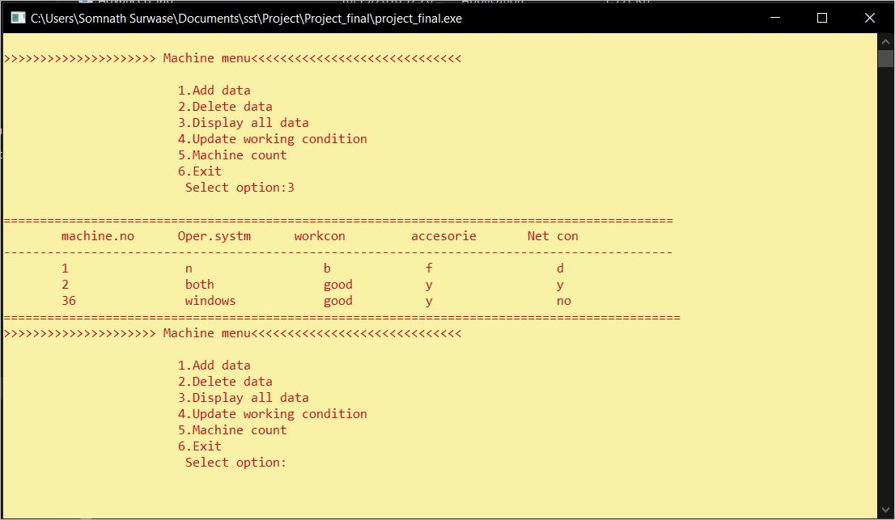

# Lab-Managent-System
This system is useful for lab admins to handle all the data regarding  machines and students. The system is developed in c++ , file handling.

Some of the screenshots of the system are as follows:

